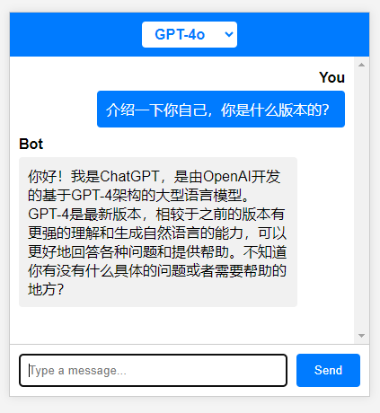

# Linux-based-AI-chat-server

## 基于Linux的AI聊天服务器
这是一个简单的AI聊天网页应用程序，包含登录、注册、聊天功能，并且处理登录失败和注册失败的情况。以下是项目的主要功能和页面截图。

使用注意事项：mysql默认的账户密码在main.cpp中，需要调整服务器端对应的配置

需要在ChatBot.cpp文件中添加自己的gpt-key

## 页面展示

### 登录或注册页面

- 用户可以在此页面输入用户名和密码进行登录。

### 注册页面

- 新用户可以在此页面输入相关信息进行注册。

### 登录失败页面

- 当用户输入错误的用户名或密码时，显示登录失败提示。

### 不同大模型聊天页面

- 用户登录后，可以在此页面与不同的大模型进行聊天访问。
